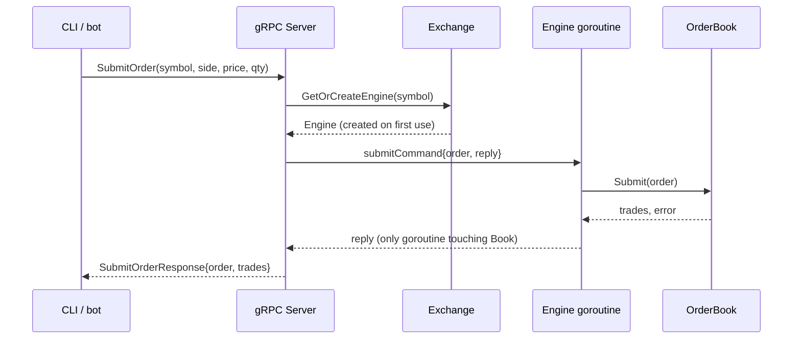
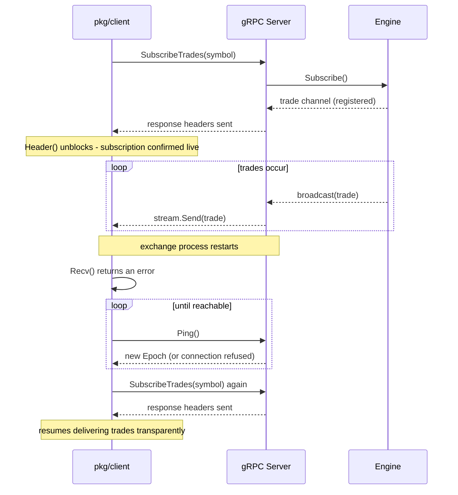
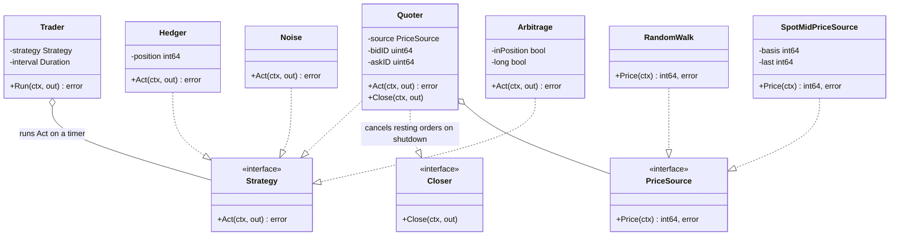
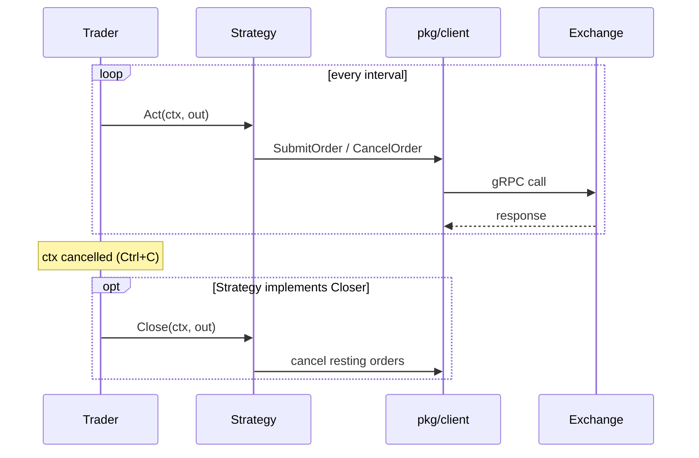
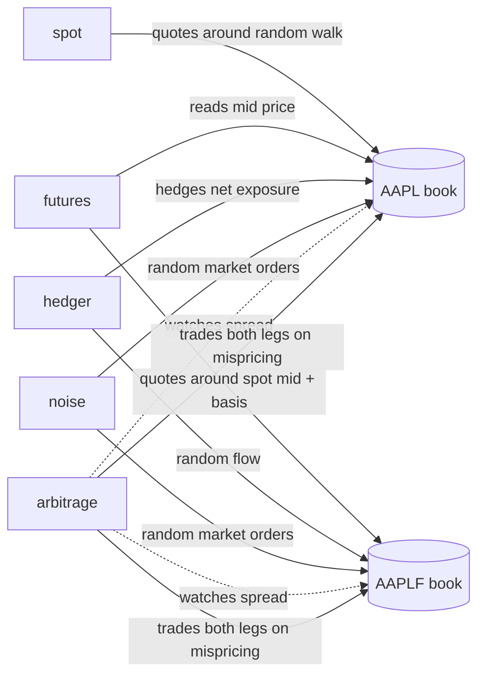

# Architecture

Design decisions, trade-offs, and diagrams for Janus. For what the project is and how to run it, see [README.md](README.md). For what's left, see [TODO.md](TODO.md).

## Contents

- [Core matching engine](#core-matching-engine)
- [Concurrency model](#concurrency-model)
- [gRPC API](#grpc-api)
- [Request flow](#request-flow)
- [Trade subscription and reconnection](#trade-subscription-and-reconnection)
- [Go client library (`pkg/client`)](#go-client-library-pkgclient)
- [CLI (`cmd/cli`)](#cli-cmdcli)
- [Bots](#bots)
- [Domain concepts](#domain-concepts)
- [Package layout](#package-layout)

## Core matching engine

```mermaid
classDiagram
    class Exchange {
        -mu sync.Mutex
        -engines map~string,Engine~
        +Epoch uint64
        +GetOrCreateEngine(symbol) Engine
        +Close()
    }
    class OrderBook {
        +Symbol string
        -bids BookSide
        -asks BookSide
        -orders map~uint64,Order~
        -seq uint64
        +BestBid() PriceLevel
        +BestAsk() PriceLevel
        +Order(id) Order
        +Depth(n) BookSnapshot
        +Submit(order) Trade[]~error~
        +Cancel(id) Order~error~
    }
    class BookSide {
        -side Side
        -levels map~int64,PriceLevel~
        -prices int64[]
        +GetOrCreateLevel(price) PriceLevel
        +Level(price) PriceLevel
        +RemoveLevel(price)
        +Best() PriceLevel
        +Depth(n) PriceLevelSnapshot[]
        +IsEmpty() bool
    }
    class PriceLevel {
        -price int64
        -orders list.List
        -index map~uint64,Element~
        +Price() int64
        +Add(order)
        +Remove(orderID) bool
        +Front() Order
        +PopFront() Order
        +Len() int
        +TotalQuantity() uint64
        +IsEmpty() bool
    }
    class Order {
        +ID uint64
        +Symbol string
        +Side Side
        +Type OrderType
        +Price int64
        +Quantity uint64
        +Remaining uint64
    }
    class Trade {
        +ID uint64
        +Price int64
        +Quantity uint64
        +MakerOrderID uint64
        +TakerOrderID uint64
    }
    class Engine {
        -book OrderBook
        -inbox chan~any~
        -done chan~struct~
        -subs subscribers
        +Run()
        +Stop()
        +Submit(order) Trade[]~error~
        +Cancel(id) Order~error~
        +Depth(n) BookSnapshot
        +Subscribe() chan_Trade,func
    }
    class Server {
        -exchange Exchange
        +SubmitOrder(req) SubmitOrderResponse~error~
        +CancelOrder(req) CancelOrderResponse~error~
        +GetOrderBook(req) GetOrderBookResponse~error~
        +SubscribeTrades(req, stream) error
        +Ping(req) PingResponse~error~
    }
    class Client {
        -conn grpc.ClientConn
        -stub pb.ExchangeClient
        +Dial(addr) Client~error~
        +SubmitOrder(...) Order,Trade[]~error~
        +CancelOrder(...) Order~error~
        +GetOrderBook(...) BookSnapshot~error~
        +SubscribeTrades(...) chan_Trade~error~
        +Ping(ctx) uint64~error~
        +Close() error
    }

    Exchange "1" o-- "*" Engine : keyed by symbol, one goroutine each
    Engine "1" o-- "1" OrderBook : exclusive access, via channel
    OrderBook "1" o-- "2" BookSide : bids / asks
    BookSide "1" o-- "*" PriceLevel
    PriceLevel "1" o-- "*" Order : FIFO queue
    Trade ..> Order : references MakerOrderID / TakerOrderID
    Server "1" o-- "1" Exchange : routes each request by symbol
    Client ..> Server : gRPC, over the network
```



## Concurrency model

**`OrderBook` is protected by single-goroutine ownership, not a lock.** Once wrapped in an `Engine`, the *only* goroutine that ever calls `Submit`/`Cancel` — and therefore the only one that ever touches `PriceLevel.index`, `BookSide.levels`/`prices`, or `OrderBook.orders` — is `Engine.Run()`'s own goroutine. Every other caller sends a command over a channel and blocks for the reply. This is Go's "share memory by communicating": instead of locking those maps, the code structurally guarantees only one goroutine can ever reach them, so there's nothing to lock.

**`Exchange` is protected by a plain `sync.Mutex` instead**, because it's a genuinely different shape of problem. `GetOrCreateEngine`'s critical section is just a map lookup (and, once per symbol, an insert plus spawning a goroutine) — nanoseconds of work, called very frequently, with no real logic to serialize. Routing that through a dedicated channel and goroutine the way `OrderBook` does would be pure overhead for no benefit. Neither approach is "more correct" in general — the right synchronization primitive follows from the shape of the critical section it's protecting.

**Shutdown doesn't close the channel callers send on.** `inbox` has many senders (every `Submit`/`Cancel`/etc. call) and exactly one closer, and sending on a closed channel panics regardless of who closed it. Instead, `Stop()` closes a separate `done` channel that every public method also watches via `select` alongside its actual send/receive — a call racing with shutdown either completes normally or returns `ErrEngineStopped`, but never panics. `Stop()` itself is wrapped in `sync.Once` since closing an already-closed channel is a separate panic.

**Trade subscriptions are broadcast, not delivered reliably.** After every `Submit`, `Run` tries to send each resulting trade to every subscriber with a non-blocking `select`/`default` — if a subscriber's buffer is full (or it isn't registered yet), that trade is dropped *for that subscriber* rather than blocking. The alternative (a blocking send) would mean one slow bot could stall matching for every other participant. This mirrors how real market data feeds work: fall behind and you miss messages, you don't get the exchange to wait for you. See [Trade subscription and reconnection](#trade-subscription-and-reconnection) for how the client side copes with this.

**Each Engine command has its own type instead of one shared struct.** `Engine`'s inbox carries `any`, and `Run` dispatches with a type-switch (`submitCommand`, `cancelCommand`, `depthCommand`, ...), each with a reply channel of exactly the type it needs. This started as one shared `result` struct; it grew unwieldy once it reached 7 fields of genuinely different shapes for 8 command kinds that each only used 2-3 of them. A small generic helper (`call[R any]`) keeps the shutdown-safe send/receive logic in one place despite each command having its own reply type.

## gRPC API

The service is defined in `proto/janus.proto` (source of truth) and generated into `internal/api/proto` via `protoc` — nothing there is hand-edited (`make proto` regenerates it). `internal/api/server.go` implements the service by routing each request to the right `Engine` via `Exchange.GetOrCreateEngine(symbol)`.

**Domain errors map to gRPC status codes.** `ErrInvalidQuantity`/`ErrInvalidPrice`/`ErrSymbolMismatch` become `InvalidArgument`, `ErrOrderNotFound` becomes `NotFound`, `ErrEngineStopped` becomes `Unavailable` — a client gets a structured status it can branch on instead of parsing an error string.

**`SubscribeTrades` is a server-streaming RPC**, not polling. It sends response headers explicitly (`stream.SendHeader`) the moment it's actually registered with the engine, *before* entering its send loop — closing a real race where a trade fired immediately after subscribing could be silently dropped by the non-blocking broadcast before the server had gotten around to registering. See [Trade subscription and reconnection](#trade-subscription-and-reconnection).

**`Ping` is a lightweight liveness/identity check.** It returns `Epoch`, a random value the `Exchange` picks once at startup. A different epoch than one previously seen is unambiguous proof the exchange restarted and lost all state — something a plain "is the connection alive" check can't tell you, since restarting a process and rebinding to the same port looks identical to a still-alive connection from the outside. The server also registers the standard `grpc.health.v1.Health` service (`google.golang.org/grpc/health`) alongside this — free interoperability with tooling like `grpcurl --health` or Kubernetes-style liveness probes, separate from our own epoch mechanism.

**Unary handlers check `ctx.Err()` before doing any work**, but don't propagate context into `Engine` itself — engine calls complete in hundreds of nanoseconds, far faster than any client could realistically observe and cancel mid-flight.

## Request flow

A `SubmitOrder` call, end to end:



`CancelOrder` and `GetOrderBook` follow the same shape with a different command type; `SubscribeTrades` is different enough to warrant its own diagram below.

## Trade subscription and reconnection

Subscribing, and recovering from the exchange restarting mid-session:



Two separate mechanisms make this reliable, both covered above: `SendHeader`/`Header()` closes the *registration* race (never miss a trade because the server hadn't subscribed yet), and `Ping`'s `Epoch` closes the *identity* race (know for certain the exchange restarted, not just that the connection blipped). Client-side gRPC keepalives (`Time: 5s`, `Timeout: 3s`, `PermitWithoutStream: true`) bound how long it takes to even notice the connection is dead in the first place, rather than depending on the OS to ever signal it.

## Go client library (`pkg/client`)

Unlike `internal/api` (the server), this is meant to be imported — by the CLI and by every bot. That's why it lives under `pkg/` instead of `internal/`: consumers talk to the server over the network in any language, but a Go client library specifically needs to be importable, including from a separate module later.

**Three type representations exist end to end, not two.** `internal/types` is the engine's own domain vocabulary; the generated protobuf types are the wire contract; `pkg/client`'s `Order`/`Trade`/`PriceLevel`/`BookSnapshot` are a third, hand-written set, deliberately decoupled from both, so the public API's contract can evolve independently of the wire format. `pkg/client/convert.go` is the small mapper between them.

**`SubscribeTrades` returns a plain `<-chan Trade`**, not a raw gRPC stream, and reconnects automatically on failure (see above) — every consumer just ranges over a channel; none of them need to know gRPC streaming exists, let alone that it can fail and recover.

## CLI (`cmd/cli`)

The first real consumer of `pkg/client` — a REPL, script-file runner, and one-shot command runner, nothing more. `internal/cli/parse.go` turns one line of text into a `Command` as a pure function with no I/O.

**The symbol is a required positional argument** (`janus AAPL ...`), not a flag with a default — a wrong instrument traded silently is a worse failure mode than a wrong address, which just fails loudly to connect.

**Three invocation modes**, all driving the same parse-and-dispatch code path: interactive (`janus AAPL`), script file (`janus -script f.txt AAPL`), and one-shot (`janus AAPL buy 10 @ 105`, runs once and exits — flags must come before the symbol, since the Go `flag` package stops parsing flags at the first bare argument).

**`watch` only stops on an OS signal (`Ctrl+C`)**, scoped via `signal.NotifyContext` to just that one command, so it drops back to the prompt rather than killing the whole session.

## Bots

Five independent programs, each a standalone `pkg/client` consumer, trading against each other and any human via the CLI to create organic price movement — this is what makes Janus a market instead of just an order book with an API in front of it.



**`Trader` + `Strategy` is the one runner for every bot**, maker and taker alike. `Strategy` is one decision-and-trade cycle; `Closer` is an optional extension (checked via type assertion, like `io.Closer`) for bots that need cleanup before exiting — only `Quoter` needs it, to cancel its resting orders rather than leaving stale liquidity behind.



**The five bots and what each one does:**

- **`spot`** — `Quoter` + `RandomWalk`. Continuously quotes both sides of the spot book around a synthetic reference price, since there's no external market to derive one from yet. Cancels its old quotes *before* submitting new ones each cycle; submitting first would let a fast-moving reference price cross the bot's own still-resting orders (a self-trade).
- **`futures`** — `Quoter` + `SpotMidPriceSource`. Same quoting loop, but its reference price is the spot book's mid-price plus a fixed basis, coupling the futures instrument to the spot market. Holds the last known-good price during a momentary gap in the spot book (mid-requote) rather than a fixed fallback.
- **`hedger`** — takes random flow positions in futures (standing in for "some reason to have a position," deliberately not a real signal) and, once net exposure crosses a threshold, flattens it with an offsetting trade in spot. Tracks one combined exposure number rather than separate futures/spot books, since the two instruments are defined to move together.
- **`noise`** — stateless; submits random-direction market orders across whichever symbols it's configured for, adding uninformed volume with no view.
- **`arbitrage`** — watches the spot/futures spread against a configured fair basis, enters a position (both legs) once the deviation crosses a threshold, and closes once the spread has reverted halfway back — a fixed hysteresis band rather than a separate config knob, so it doesn't flip-flop right at the entry boundary.



## Domain concepts

**Price is an integer, never a float.** `Price` is stored as an integer number of ticks, not `float64` — floats introduce rounding error that's unacceptable once you're summing trade values.

**Quantity vs. Remaining.** `Quantity` is the original size requested and never changes; `Remaining` is how much is still unmatched and decreases with partial fills. This mirrors `OrderQty`/`LeavesQty` in FIX, the real-world protocol most exchanges use.

**Maker vs. Taker.** The **maker** was already resting on the book (provided liquidity); the **taker** is the incoming order that crossed the spread (consumed liquidity). A trade always executes at the maker's price.

**`ID` is engine-assigned and doubles as the ordering key.** Assigned from an internal monotonic counter, not supplied by the caller, so collisions are structurally impossible. There's no separate timestamp field — since the counter is strictly increasing, `ID` alone already answers "did this happen before that," the same way a Kafka offset does.

**`Depth` is an L2 view, not L3.** Reports a price and its *total* resting quantity per level, not the individual orders making it up — the same distinction real market data feeds draw between L2 (aggregated depth) and L3 (every individual order).

## Package layout

```
cmd/
    server/                    gRPC server entrypoint
    cli/                       CLI entrypoint
    bots/strategies/
        spot/, futures/,
        hedger/, noise/,
        arbitrage/             one thin entrypoint per bot
internal/
    types/                     engine's own domain vocabulary
    engine/                    OrderBook, BookSide, PriceLevel, Engine, Exchange
    api/                       gRPC server implementation
        proto/                 generated code (never hand-edited)
    cli/                       parse/run/format for the CLI
    bots/                      shared bot infrastructure: Quoter/PriceSource, Trader/Strategy
        strategies/
            spot/, futures/    PriceSource implementations
            hedger/, noise/,
            arbitrage/         Strategy implementations
pkg/
    client/                    public, importable Go client for the gRPC API
proto/
    janus.proto                service definition, source of truth
```
