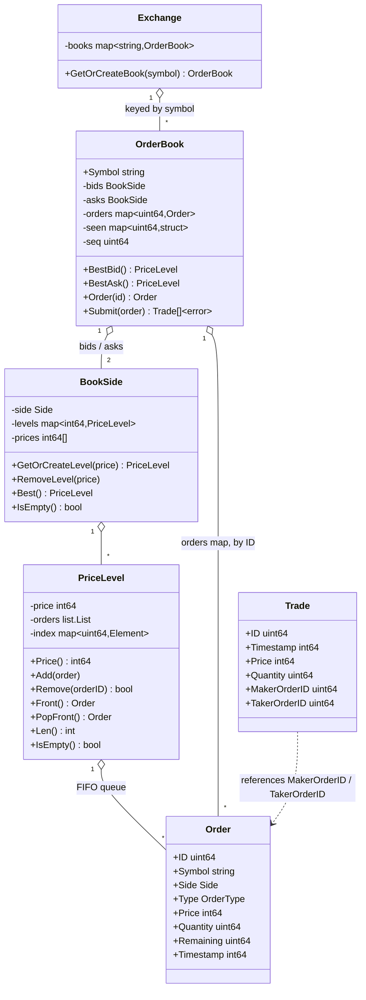

# Janus

A high-performance order matching engine simulating a financial exchange, written in Go.

Implements an in-memory order book with price-time priority matching for limit and market orders. Concurrency (a channel-based model) and an API/CLI surface are planned but not built yet — see Status below.

## Architecture

Updated as implementation progresses — currently reflects everything built so far: price-time priority matching exists; concurrency, CLI, and REST API do not yet.

## Domain concepts

**Price is an integer, never a float.** `Price` is stored as an integer number of ticks (the smallest price increment), not `float64`. Floats introduce rounding error that's unacceptable once you're summing trade values — this is standard practice in real trading systems.

**Quantity vs. Remaining.** `Quantity` is the original size the client asked for and never changes. `Remaining` is how much of that order is still unmatched, and decreases as partial fills happen. Both are needed because an order is rarely filled in one shot — it's usually pieced together from several smaller counter-orders over one or more matching passes, so the engine needs a running counter (`Remaining`) separate from the original request (`Quantity`). This mirrors `OrderQty`/`LeavesQty` in FIX, the real-world protocol most exchanges use for order messaging.

**Maker vs. Taker.** When two orders match, the **maker** is the order that was already resting on the book (it provided liquidity); the **taker** is the incoming order that crossed the spread and caused the match (it consumed liquidity). A trade always executes at the maker's price. This distinction is the basis for maker/taker fee schedules on real exchanges, and for a market-making strategy specifically, tracking your own maker-fill ratio is how you'd measure whether you're actually providing liquidity.

## Status

Core matching is implemented and tested: `OrderBook.Submit` matches limit and market orders by price-time priority, validates input (rejects zero quantity, mismatched symbols, and reused order IDs), and returns an error rather than failing silently. Not yet built: order cancellation, concurrency, CLI, REST API.
