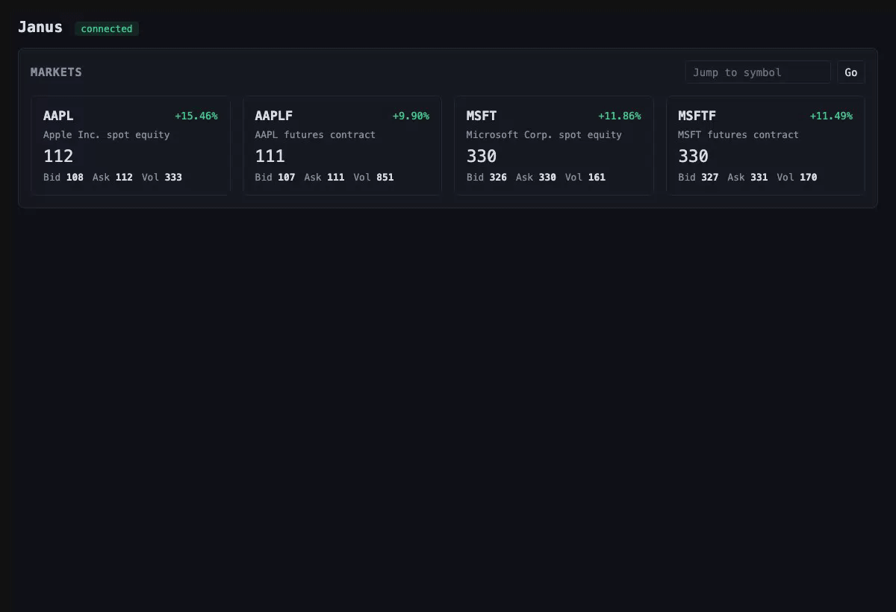
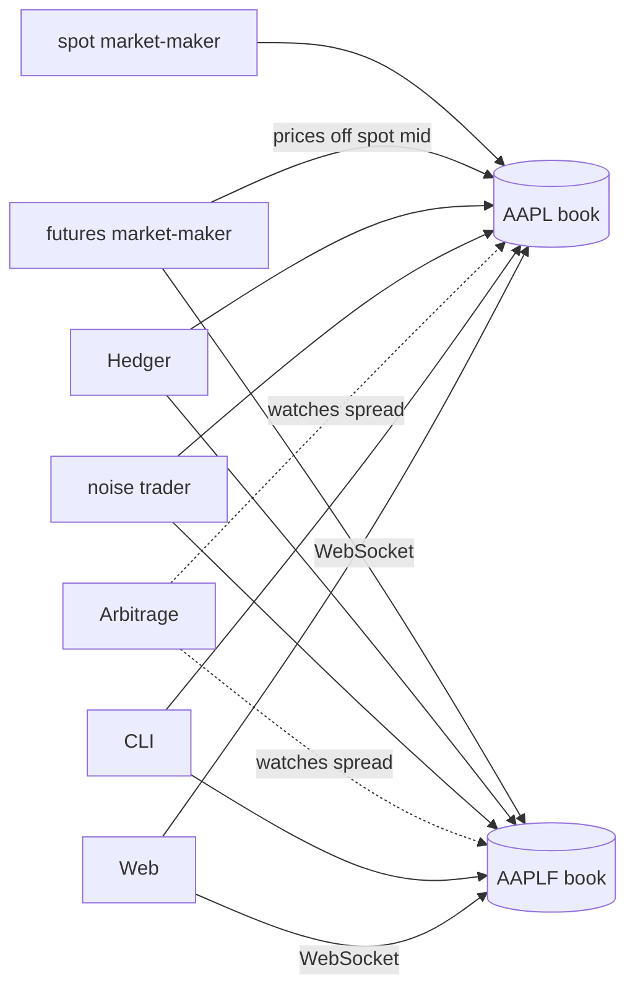

# Janus

A simulated financial market, written in Go - not just a matching engine, but a living market. An in-memory exchange sits behind a gRPC API, and independent bot programs (market makers, a hedger, a noise trader, an arbitrage bot) trade against each other over that same API, so prices move from emergent activity rather than only from whatever a human submits by hand. Watch it happen live in a browser, or drive it yourself from a CLI.

## How it works



## Who's trading



Details on how each piece works, the concurrency model, and full diagrams live in **[ARCHITECTURE.md](docs/ARCHITECTURE.md)**.

## Quick start

Everything below is a `Makefile` target - run `make help` for the full list.

```sh
make simulate    # one command: server, web UI, 12 markets, and a full fleet of bots trading them
```

Opens the web UI in your browser automatically. Ctrl+C stops everything cleanly.

To run pieces by hand instead:

```sh
make build              # build every binary into bin/
make run-server         # start the exchange (Ctrl+C to stop)

# in another terminal, list an instrument before anything can trade it:
make run-cli ARGS="AAPL register Apple Inc."

# then, in other terminals:
make run-spot    ARGS="AAPL"
make run-futures ARGS="-spot AAPL AAPLF"
make run-hedger  ARGS="-futures AAPLF -spot AAPL"
make run-noise   ARGS="-symbols AAPL,AAPLF"
make run-arbitrage ARGS="-spot AAPL -futures AAPLF"

make run-watch ARGS="AAPL"                   # stream live trades
make run-cli   ARGS="AAPL"                   # interactive session: buy/sell/book/cancel
make run-web   ARGS="-addr localhost:50051"  # web UI at :8080
```

`make check` runs formatting, `go vet`, and the full test suite (with `-race`).

## Components

### Core exchange

- **Matching engine** - in-memory order book, price-time priority, limit and market orders, integer-tick pricing. Property-tested and benchmarked.
- **Explicit market registration** - a symbol must be listed before anything can trade, watch, or query it; nothing is created lazily on first order. Modeled after how real exchanges separate listing an instrument from trading it - bots never register anything, only the CLI/operator does.
- **Per-symbol market stats and trade history** - last/open/high/low price and volume, plus a bounded recent-trade ring buffer, exposed over gRPC and used to drive the web UI's markets list and price chart.
- **Persistence** - every book's resting orders, sequence counter, and description are snapshotted to disk periodically and on shutdown, and restored on startup, so a restart resumes rather than starts empty.
- **gRPC API** - submit, cancel, book snapshots, market listing/registration/stats, a streaming trade feed, and a liveness/restart-detection check, all backed directly by the engine.

### Client and bots

- **Go client library (`pkg/client`)** - the public, importable foundation every consumer (CLI, bots, web UI) is built on, with automatic reconnection for the trade feed.
- **Five bots** - two market makers (spot, futures), a hedger, a noise trader, and an arbitrage bot, all sharing one runner/strategy pattern and submitting randomized order sizes for a more realistic-looking book. See [ARCHITECTURE.md](docs/ARCHITECTURE.md#bots) for what each one actually does.

### Interfaces

- **CLI (`cmd/cli`)** - interactive REPL, script-file replay, one-shot commands, and market registration.
- **Web UI (`cmd/web`)** - a hand-rolled WebSocket server (`internal/websocket`), a JSON-to-`pkg/client` bridge (`internal/web`), and a vanilla JS/HTML/CSS frontend embedded via `embed.FS`: a live markets overview and a per-symbol view with an order-book depth ladder, a colored trade tape, and a price chart.

## Performance

Bottlenecks were identified using `pprof` and confirmed with benchmarks. Full details are documented in [ARCHITECTURE.md](docs/ARCHITECTURE.md#performance).

| Change | Before | After |
| --- | --- | --- |
| `Cancel`, at a synthetic 100,000-tick price spread (tick array replacing a sorted-slice-plus-binary-search index) | ~770 ns/op | ~110 ns/op |
| `Engine.Submit` allocations (pooled reply channels and `PriceLevel`s) | 7 allocs/op | 3 allocs/op |
| `Engine.Cancel` allocations (same pooling) | 3 allocs/op | 1 alloc/op |

## Project layout

```
cmd/            binaries: server, cli, web UI, and one entrypoint per bot
internal/       engine, gRPC server, persistence, WebSocket/web bridge, CLI, and bots (not importable outside this module)
pkg/client/     the public Go client library
proto/          janus.proto - the gRPC service definition, source of truth
scripts/        simulate.sh - one-command demo: server + web UI + a full bot fleet across 12 markets
docs/           ARCHITECTURE.md and the screenshots/GIF used above
```
