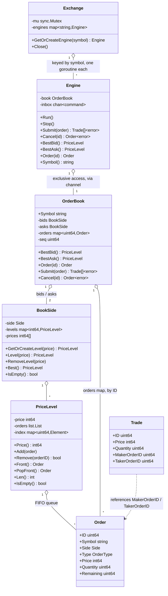

# Janus

A simulated financial market, written in Go — not just a matching engine, but a living market: independent bot programs (market makers, eventually a user-built strategy) connect over gRPC and trade against each other, so prices move from emergent activity rather than only from whatever a human submits by hand.

Core matching (in-memory order book, price-time priority, limit and market orders) is implemented and tested. A channel-based concurrency wrapper (`Engine`) now serializes access to each book so multiple independent clients can submit/cancel concurrently. Still to come: a gRPC API server, a CLI/REPL client of that API, and the bot programs themselves — see Status below.

## Architecture

Updated as implementation progresses — currently reflects everything built so far: price-time priority matching and the concurrency wrapper exist; the gRPC API, CLI, and bots do not yet.

## Concurrency model

**`OrderBook` is protected by single-goroutine ownership, not a lock.** Once wrapped in an `Engine`, the *only* goroutine that ever calls `Submit`/`Cancel` — and therefore the only one that ever touches `PriceLevel.index`, `BookSide.levels`/`prices`, or `OrderBook.orders` — is `Engine.Run()`'s own goroutine. Every other caller sends a command over a channel and blocks for the reply. This is Go's "share memory by communicating": instead of locking those maps, the code structurally guarantees only one goroutine can ever reach them, so there's nothing to lock.

**`Exchange` is protected by a plain `sync.Mutex` instead**, because it's a genuinely different shape of problem. `GetOrCreateEngine`'s critical section is just a map lookup (and, once per symbol, an insert plus spawning a goroutine) — nanoseconds of work, called very frequently, with no real logic to serialize. Routing that through a dedicated channel and goroutine the way `OrderBook` does would be pure overhead for no benefit. Channels earn their keep when the per-call work is substantial (matching logic); a mutex is the right tool for small, hot, frequently-accessed shared state. Neither approach is "more correct" than the other in general — the right synchronization primitive follows from the shape of the critical section it's protecting, not a blanket rule.

## Domain concepts

**Price is an integer, never a float.** `Price` is stored as an integer number of ticks (the smallest price increment), not `float64`. Floats introduce rounding error that's unacceptable once you're summing trade values — this is standard practice in real trading systems.

**Quantity vs. Remaining.** `Quantity` is the original size the client asked for and never changes. `Remaining` is how much of that order is still unmatched, and decreases as partial fills happen. Both are needed because an order is rarely filled in one shot — it's usually pieced together from several smaller counter-orders over one or more matching passes, so the engine needs a running counter (`Remaining`) separate from the original request (`Quantity`). This mirrors `OrderQty`/`LeavesQty` in FIX, the real-world protocol most exchanges use for order messaging.

**Maker vs. Taker.** When two orders match, the **maker** is the order that was already resting on the book (it provided liquidity); the **taker** is the incoming order that crossed the spread and caused the match (it consumed liquidity). A trade always executes at the maker's price. This distinction is the basis for maker/taker fee schedules on real exchanges, and for a market-making strategy specifically, tracking your own maker-fill ratio is how you'd measure whether you're actually providing liquidity.

**`ID` is engine-assigned and doubles as the ordering key.** `Order.ID` and `Trade.ID` are assigned by the engine from an internal monotonic counter, not supplied by the caller — this makes collisions structurally impossible rather than something to detect and reject. There's no separate timestamp field: since the counter is strictly increasing, `ID` alone already answers "did this happen before that?" (`a.ID < b.ID`), the same way a Kafka offset or a database log sequence number serves as both a unique identifier and an ordering key at once.

## Status

Core matching is implemented and tested: `OrderBook.Submit` matches limit and market orders by price-time priority, assigns each order's `ID` itself (so IDs can't collide or be spoofed by a caller), validates input (rejects zero quantity and mismatched symbols), and returns an error rather than failing silently. `OrderBook.Cancel` removes a resting order by ID, cleaning up its price level if that was the last order there. Property tests run thousands of randomized orders and assert quantity conservation, that the book never crosses, and that FIFO priority holds at a shared price level.

`Engine` wraps an `OrderBook` so only one goroutine ever touches it directly — every other caller communicates through a channel and blocks for the reply. Verified race-free (`go test -race`) with 50 goroutines submitting concurrently.

`Exchange` now hands out one `Engine` per symbol (starting its goroutine on first request) rather than a raw `OrderBook` — this is the sharding story pulled forward from a later phase, since it was a natural fit once `Engine` existed. Its own internal map is mutex-protected, verified race-free with 50 goroutines requesting the same new symbol simultaneously.

Not yet built, roughly in order: a gRPC API server (submit/cancel/snapshot, plus a streaming subscription for live trades/book updates), a CLI/REPL that's a client of that API (interactive and script-file modes), a market-maker bot, a second (futures) instrument with its own market-maker bot pricing off the spot book, and a user-built trading strategy bot to trade against all of that emergent activity.
