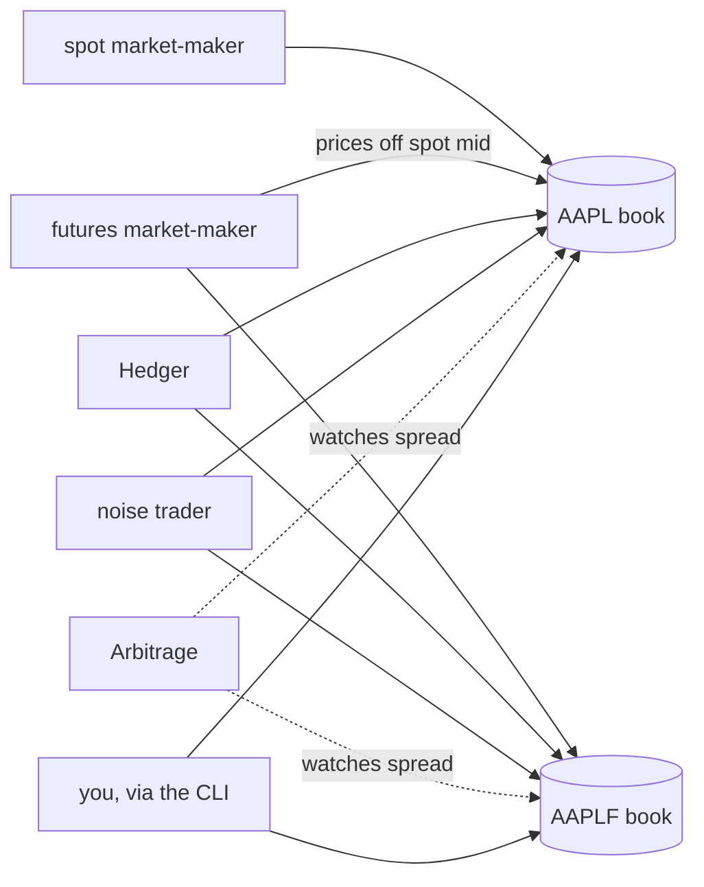

# Janus

A simulated financial market, written in Go — not just a matching engine, but a living market. An in-memory exchange sits behind a gRPC API, and independent bot programs (market makers, a hedger, a noise trader, an arbitrage bot) connect over that same API and trade against each other, so prices move from emergent activity rather than only from whatever a human submits by hand.



Details on how each piece works, the concurrency model, and full diagrams live in **[ARCHITECTURE.md](ARCHITECTURE.md)**. What's left to build is in **[TODO.md](TODO.md)**.

## Quick start

Everything below is a `Makefile` target — run `make help` for the full list.

```sh
make build              # build every binary into bin/
make run-server         # start the exchange (Ctrl+C to stop)

# in other terminals:
make run-spot    ARGS="AAPL"
make run-futures ARGS="-spot AAPL AAPLF"
make run-hedger  ARGS="-futures AAPLF -spot AAPL"
make run-noise   ARGS="-symbols AAPL,AAPLF"
make run-arbitrage ARGS="-spot AAPL -futures AAPLF"

make run-watch ARGS="AAPL"          # stream live trades
make run-cli   ARGS="AAPL"          # interactive session: buy/sell/book/cancel
```

`make check` runs formatting, `go vet`, and the full test suite (with `-race`).

## What's built

- **Matching engine** — in-memory order book, price-time priority, limit and market orders, integer-tick pricing. Property-tested and benchmarked.
- **gRPC API** — submit, cancel, book snapshots, a streaming trade feed, and a liveness/restart-detection check, all backed directly by the engine.
- **Go client library (`pkg/client`)** — the public, importable foundation every consumer (CLI, bots) is built on, with automatic reconnection for the trade feed.
- **CLI (`cmd/cli`)** — interactive REPL, script-file replay, and one-shot commands.
- **Five bots** — two market makers (spot, futures), a hedger, a noise trader, and an arbitrage bot, all sharing one runner/strategy pattern. See [ARCHITECTURE.md](ARCHITECTURE.md#bots) for what each one actually does.

## Project layout

```
cmd/            binaries: server, cli, and one entrypoint per bot
internal/       engine, gRPC server, CLI, and bot implementations (not importable outside this module)
pkg/client/     the public Go client library
proto/          janus.proto - the gRPC service definition, source of truth
```

## Language plan

Janus is being finished completely in Go first. Once it is, the core matching engine (only) gets ported to Rust as a separate repo, for a GC-vs-no-GC latency comparison — and optionally, lower priority, to OCaml after that. Details in [TODO.md](TODO.md).
