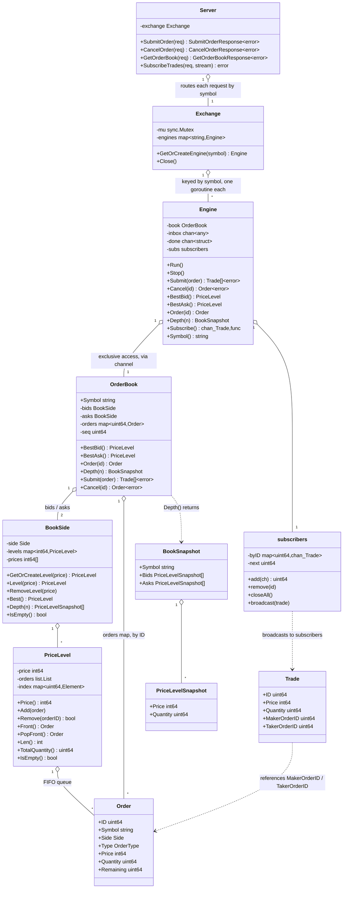

# Janus

A simulated financial market, written in Go — not just a matching engine, but a living market: independent bot programs (market makers, eventually a user-built strategy) connect over gRPC and trade against each other, so prices move from emergent activity rather than only from whatever a human submits by hand.

Core matching (in-memory order book, price-time priority, limit and market orders) is implemented and tested. A channel-based concurrency wrapper (`Engine`) serializes access to each book so multiple independent clients can submit/cancel concurrently, and a gRPC API server now exposes all of it over the network. Still to come: a CLI/REPL client of that API, and the bot programs themselves — see Status below.

## Architecture

Updated as implementation progresses — currently reflects everything built so far: price-time priority matching, the concurrency wrapper, and the gRPC API exist; the CLI and bots do not yet.

## Concurrency model

**`OrderBook` is protected by single-goroutine ownership, not a lock.** Once wrapped in an `Engine`, the *only* goroutine that ever calls `Submit`/`Cancel` — and therefore the only one that ever touches `PriceLevel.index`, `BookSide.levels`/`prices`, or `OrderBook.orders` — is `Engine.Run()`'s own goroutine. Every other caller sends a command over a channel and blocks for the reply. This is Go's "share memory by communicating": instead of locking those maps, the code structurally guarantees only one goroutine can ever reach them, so there's nothing to lock.

**`Exchange` is protected by a plain `sync.Mutex` instead**, because it's a genuinely different shape of problem. `GetOrCreateEngine`'s critical section is just a map lookup (and, once per symbol, an insert plus spawning a goroutine) — nanoseconds of work, called very frequently, with no real logic to serialize. Routing that through a dedicated channel and goroutine the way `OrderBook` does would be pure overhead for no benefit. Channels earn their keep when the per-call work is substantial (matching logic); a mutex is the right tool for small, hot, frequently-accessed shared state. Neither approach is "more correct" than the other in general — the right synchronization primitive follows from the shape of the critical section it's protecting, not a blanket rule.

**Shutdown doesn't close the channel callers send on.** An earlier version had `Stop()` call `close(e.inbox)` directly — but `inbox` has many senders (every `Submit`/`Cancel`/etc. call) and exactly one closer, and sending on a closed channel panics in Go regardless of who closed it. A caller racing with `Stop()` could crash the whole program. Instead, `Stop()` closes a separate `done` channel that every public method also watches via `select` alongside its actual send/receive — so a call racing with shutdown either completes normally (if it got in just before) or returns `ErrEngineStopped` (if not), but never panics. `Stop()` itself is wrapped in `sync.Once` so calling it twice is also safe, since closing an already-closed channel is a separate panic Go doesn't forgive either. This safety isn't free — routing every call through this extra `select` measurably increased `Engine`'s per-call cost (see Status) — but a server that can crash under a normal shutdown race isn't one worth calling correct.

**Trade subscriptions are broadcast, not delivered reliably.** `Engine.Subscribe` hands back a buffered channel; after every `Submit`, `Run` tries to send each resulting trade to every subscriber with a non-blocking `select`/`default` — if a subscriber's buffer is full, that trade is silently dropped *for that subscriber* rather than blocking. The alternative (a blocking send) would mean one slow bot could stall matching for every other participant, which defeats the entire point of the concurrency work above. This mirrors how real market data feeds work: if you fall behind, you miss messages and need to resync from a fresh snapshot (`Depth`), rather than the exchange ever waiting for you.

**Each command has its own type instead of one shared struct.** `Engine`'s inbox carries `any`, and `Run` dispatches with a type-switch (`submitCommand`, `cancelCommand`, `depthCommand`, ...), each with a reply channel of exactly the type it needs — a `bestBidCommand` replies with a bare `*PriceLevel`, not a struct with five other fields that don't apply to it. This started as one `kind` enum plus one shared `result` struct; it grew unwieldy once `result` reached 7 fields of genuinely different shapes (a `bool`, a `BookSnapshot`, a `subscription`) for 8 command kinds that each only used 2-3 of them — nothing stopped code from reading a field that was meaningless for whatever kind actually produced that result, since the correspondence was enforced only by convention, by reading `handle`'s switch statement, not by the compiler. A small generic helper (`call[R any]`) keeps the shutdown-safe send/receive logic in one place despite each command now having its own reply type.

## gRPC API

The service is defined in `proto/janus.proto` (source of truth) and generated into `internal/api/proto` via `protoc` with the Go and Go-gRPC plugins — nothing in that generated code is hand-edited. `internal/api/server.go` implements the service by routing each request to the right `Engine` via `Exchange.GetOrCreateEngine(symbol)`; `internal/api/convert.go` holds the (intentionally boring) conversions between protobuf messages and the internal `types` package. `cmd/server` is the actual binary — `go run ./cmd/server -addr :50051`.

**Domain errors map to gRPC status codes, not raw Go errors.** `ErrInvalidQuantity`/`ErrInvalidPrice`/`ErrSymbolMismatch` become `InvalidArgument`, `ErrOrderNotFound` becomes `NotFound`, `ErrEngineStopped` becomes `Unavailable` — so a client gets a real, structured status it can branch on instead of parsing an error string.

**`SubscribeTrades` is a server-streaming RPC**, not polling — a client opens one call and receives a `Trade` message every time one happens, for as long as the stream stays open. Server-side it's a thin wrapper: call `Engine.Subscribe()`, then loop forwarding each trade to `stream.Send` until the client disconnects (`stream.Context().Done()`) or the engine closes the channel. This is the same non-blocking-broadcast design documented above, now reachable over the network. Note that this loop deliberately returns the *context's* error (not `nil`) when the client disconnects or its deadline expires — that's not a missed "graceful shutdown," it's reporting the true reason the stream ended (client-caused) rather than pretending the server voluntarily finished; the genuinely voluntary case (the engine closing the trade channel from its own side) already returns `nil` on a separate branch.

**Unary handlers check `ctx.Err()` before doing any work, but don't propagate context into `Engine`.** If a request arrives already past its deadline (e.g. it sat queued upstream), the handler rejects it immediately via `status.FromContextError` instead of doing the work anyway. Going further — threading context into `Engine.Submit`/`Cancel`/etc. so an in-flight call could be aborted mid-flight — would need real API changes to `Engine` for a scenario that's currently theoretical: engine calls complete in the hundreds of nanoseconds, far faster than any client could realistically observe and act on a cancellation. Not worth the added surface area until something actually demonstrates the need.

**Tested two ways.** `internal/api/server_test.go` uses `google.golang.org/grpc/test/bufconn` for a real client/server exercising the actual gRPC wire protocol, just over an in-memory connection instead of a real socket — covering matching, cancellation, book snapshots, error codes, and the streaming subscription. Beyond that, the compiled server binary was run as a real process on a real TCP port and driven with `grpcurl` end-to-end (order matching, book depth, `NotFound`/`InvalidArgument` error codes, and a live trade arriving on an open stream) to confirm it actually works as a standalone service, not just inside a test process.

## Domain concepts

**Price is an integer, never a float.** `Price` is stored as an integer number of ticks (the smallest price increment), not `float64`. Floats introduce rounding error that's unacceptable once you're summing trade values — this is standard practice in real trading systems.

**Quantity vs. Remaining.** `Quantity` is the original size the client asked for and never changes. `Remaining` is how much of that order is still unmatched, and decreases as partial fills happen. Both are needed because an order is rarely filled in one shot — it's usually pieced together from several smaller counter-orders over one or more matching passes, so the engine needs a running counter (`Remaining`) separate from the original request (`Quantity`). This mirrors `OrderQty`/`LeavesQty` in FIX, the real-world protocol most exchanges use for order messaging.

**Maker vs. Taker.** When two orders match, the **maker** is the order that was already resting on the book (it provided liquidity); the **taker** is the incoming order that crossed the spread and caused the match (it consumed liquidity). A trade always executes at the maker's price. This distinction is the basis for maker/taker fee schedules on real exchanges, and for a market-making strategy specifically, tracking your own maker-fill ratio is how you'd measure whether you're actually providing liquidity.

**`ID` is engine-assigned and doubles as the ordering key.** `Order.ID` and `Trade.ID` are assigned by the engine from an internal monotonic counter, not supplied by the caller — this makes collisions structurally impossible rather than something to detect and reject. There's no separate timestamp field: since the counter is strictly increasing, `ID` alone already answers "did this happen before that?" (`a.ID < b.ID`), the same way a Kafka offset or a database log sequence number serves as both a unique identifier and an ordering key at once.

**`Depth` is an L2 view, not L3.** `BookSnapshot`/`PriceLevelSnapshot` report a price and its *total* resting quantity per level, not the individual orders making it up — the same distinction real market data feeds draw between "L2" (aggregated depth, what most participants get) and "L3" (every individual order, usually only the exchange itself and privileged participants see this). Individual order detail is still available separately via `Order(id)` if you already know an ID; `Depth` is specifically for "what does the book look like right now," which is what a market-maker bot or a CLI's `book` command actually needs.

## Status

Core matching is implemented and tested: `OrderBook.Submit` matches limit and market orders by price-time priority, assigns each order's `ID` itself (so IDs can't collide or be spoofed by a caller), validates input (rejects zero quantity, non-positive limit prices, and mismatched symbols), and returns an error rather than failing silently. `OrderBook.Cancel` removes a resting order by ID, cleaning up its price level if that was the last order there. `OrderBook.Depth` returns an L2 snapshot (price + aggregate quantity) for up to N levels per side. Property tests run thousands of randomized orders and assert quantity conservation, that the book never crosses, and that FIFO priority holds at a shared price level.

`Engine` wraps an `OrderBook` so only one goroutine ever touches it directly — every other caller communicates through a channel and blocks for the reply. It also supports live trade subscriptions (`Subscribe`, non-blocking broadcast that drops for slow consumers rather than stalling matching) and shuts down safely: a `Submit`/`Cancel`/etc. call racing with `Stop()` returns `ErrEngineStopped` instead of panicking, and `Stop()` is idempotent. Verified race-free (`go test -race`) including 50 goroutines submitting concurrently and 50 goroutines submitting while `Stop()` is called mid-flight.

`Exchange` now hands out one `Engine` per symbol (starting its goroutine on first request) rather than a raw `OrderBook` — this is the sharding story pulled forward from a later phase, since it was a natural fit once `Engine` existed. Its own internal map is mutex-protected, verified race-free with 50 goroutines requesting the same new symbol simultaneously.

Stress-tested beyond the basic concurrency check: 20,000 `Submit`/`Cancel` calls racing against each other (including cancelling orders that may already have been matched by another goroutine) on one `Engine`, and 6,000 operations spread across 3 symbols routed through `Exchange` — both race-free, with quantity conservation intact throughout.

Benchmarked (`go test -bench`, Apple M4 Pro): `OrderBook.Submit` direct is ~150-190ns/op (~5-6M orders/sec single-threaded, 3 allocs/op); through `Engine`'s channel it's ~530-690ns/op (~1.5-1.9M orders/sec, 5 allocs/op) — the range reflects the added `select`-based safety checks from the shutdown-safety work above, a concrete, measured cost for that correctness guarantee, not just a theoretical one.

The gRPC API server is implemented and tested: `SubmitOrder`, `CancelOrder`, `GetOrderBook`, and the `SubscribeTrades` streaming RPC, all backed directly by `Exchange`/`Engine` with no logic duplicated in the transport layer. Domain errors map to proper gRPC status codes. Verified both with in-process (`bufconn`) integration tests and by running the actual compiled server and driving it with `grpcurl` over a real socket.

Not yet built, roughly in order: a CLI/REPL that's a client of that API (interactive and script-file modes), a market-maker bot, a second (futures) instrument with its own market-maker bot pricing off the spot book, and a user-built trading strategy bot to trade against all of that emergent activity.
