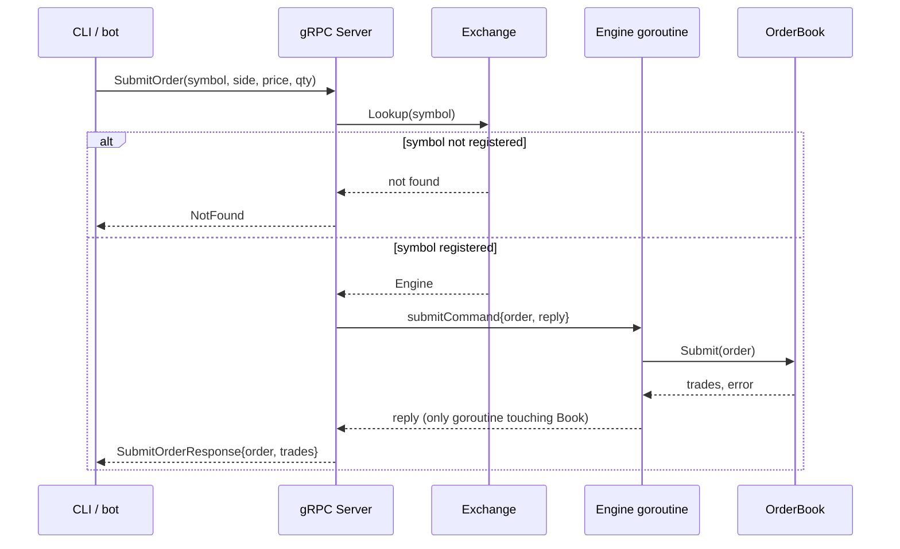
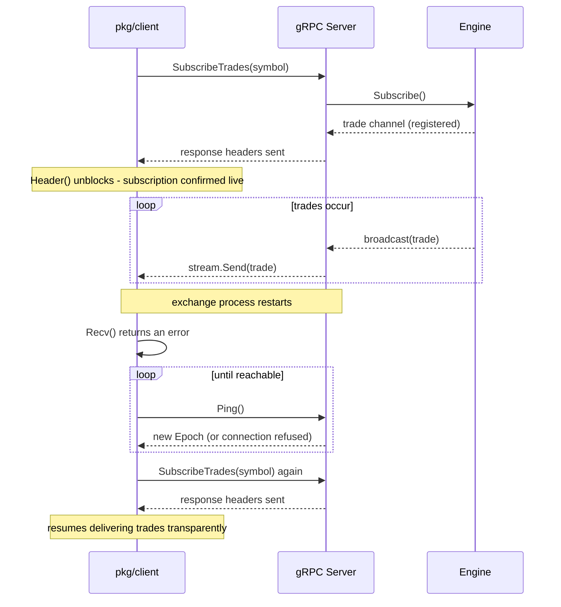
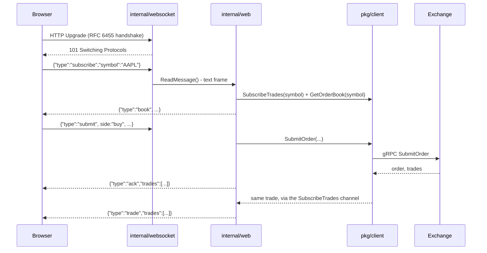
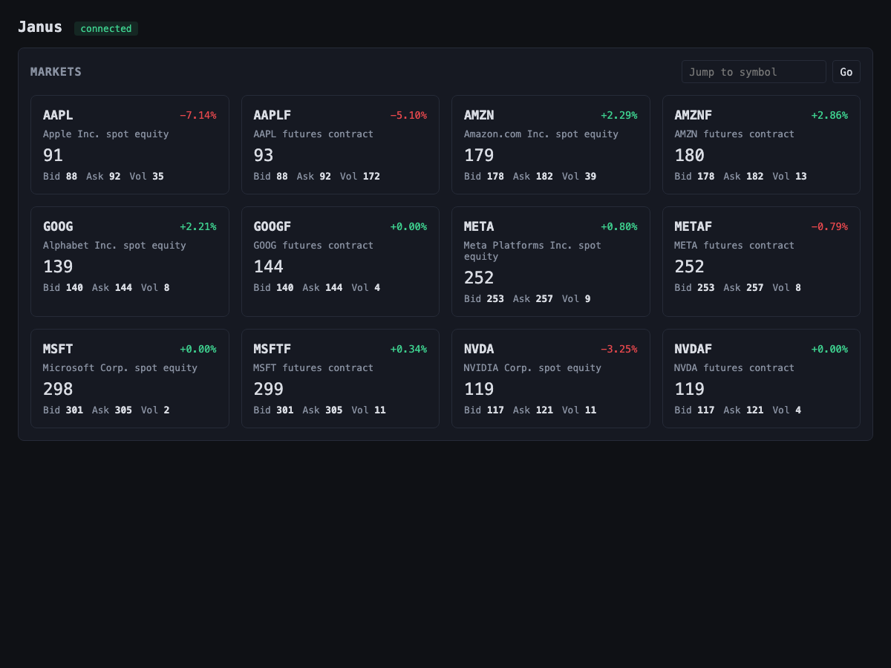
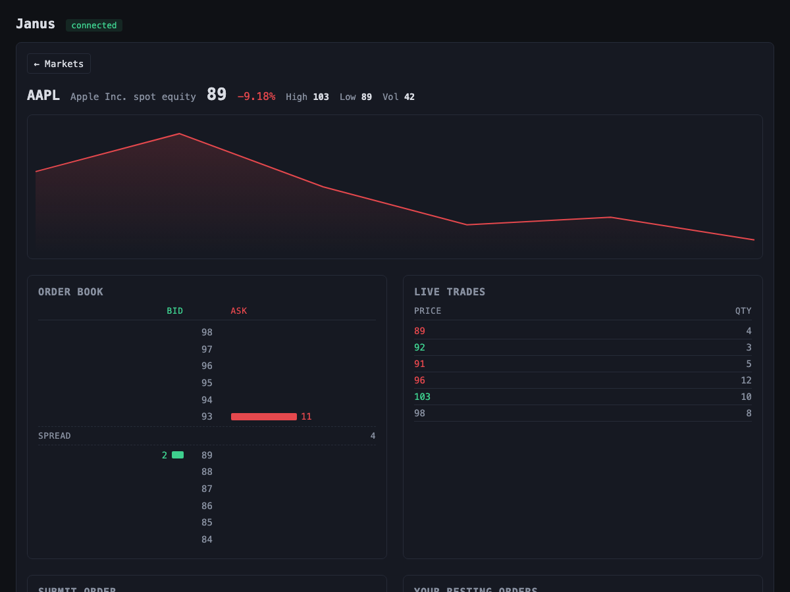
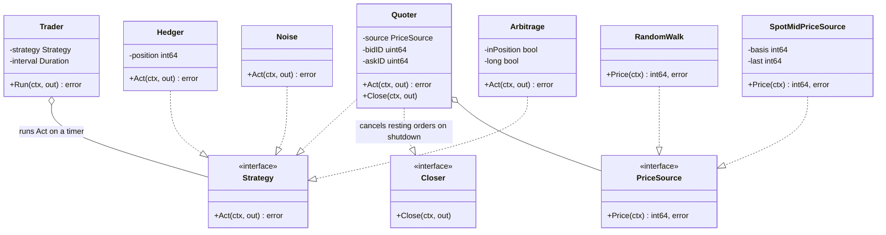
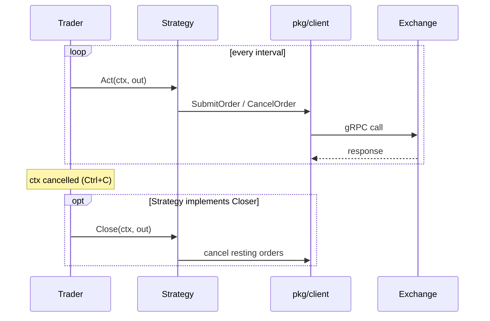
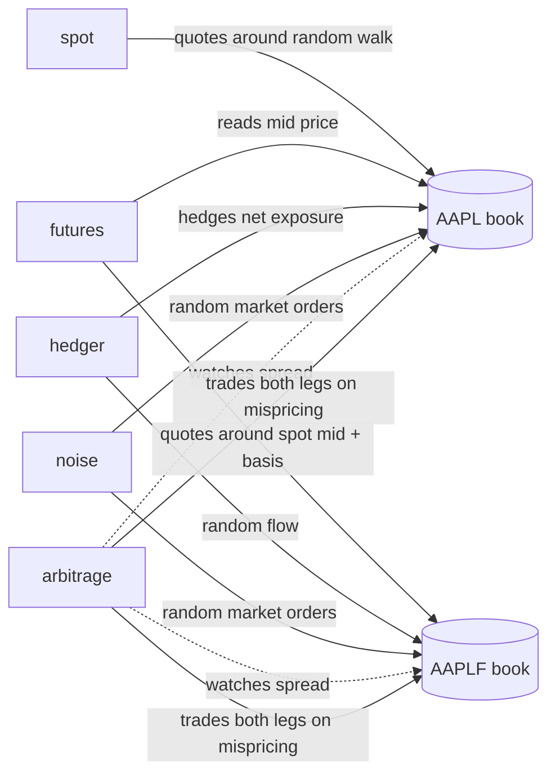

# Architecture

Design decisions, trade-offs, and diagrams for Janus. For what the project is and how to run it, see [README.md](../README.md).

## Contents

- [Core matching engine](#core-matching-engine)
- [Market registration](#market-registration)
- [Concurrency model](#concurrency-model)
- [Performance](#performance)
- [gRPC API](#grpc-api)
- [Request flow](#request-flow)
- [Trade subscription and reconnection](#trade-subscription-and-reconnection)
- [Go client library (`pkg/client`)](#go-client-library-pkgclient)
- [CLI (`cmd/cli`)](#cli-cmdcli)
- [WebSocket bridge (`cmd/web`)](#websocket-bridge-cmdweb)
- [Web frontend](#web-frontend)
- [Bots](#bots)
- [Domain concepts](#domain-concepts)
- [Package layout](#package-layout)

## Core matching engine

```mermaid
classDiagram
    class Exchange {
        -mu sync.RWMutex
        -engines map~string,Engine~
        -descriptions map~string,string~
        +Epoch uint64
        +Register(symbol, description) Engine
        +Lookup(symbol) Engine, bool
        +Description(symbol) string
        +Symbols() string[]
        +Close()
    }
    class OrderBook {
        +Symbol string
        -bids BookSide
        -asks BookSide
        -orders map~uint64,Order~
        -seq uint64
        -stats MarketStats
        -history tradeRing
        +BestBid() PriceLevel
        +BestAsk() PriceLevel
        +Stats() MarketStats
        +History() Trade[]
        +Order(id) Order
        +Depth(n) BookSnapshot
        +Submit(order) Trade[]~error~
        +Cancel(id) Order~error~
    }
    class BookSide {
        -side Side
        -tick tickArray
        -best int64
        -free PriceLevel[]
        +GetOrCreateLevel(price) PriceLevel
        +Level(price) PriceLevel
        +RemoveLevel(price)
        +Best() PriceLevel
        +Depth(n) PriceLevelSnapshot[]
        +IsEmpty() bool
    }
    class PriceLevel {
        -price int64
        -orders list.List
        -index map~uint64,Element~
        +Price() int64
        +Add(order)
        +Remove(orderID) bool
        +Front() Order
        +PopFront() Order
        +Len() int
        +TotalQuantity() uint64
        +IsEmpty() bool
    }
    class Order {
        +ID uint64
        +Symbol string
        +Side Side
        +Type OrderType
        +Price int64
        +Quantity uint64
        +Remaining uint64
    }
    class Trade {
        +ID uint64
        +Price int64
        +Quantity uint64
        +MakerOrderID uint64
        +TakerOrderID uint64
    }
    class Engine {
        -book OrderBook
        -inbox chan~any~
        -done chan~struct~
        -subs subscribers
        +Run()
        +Stop()
        +Submit(order) Trade[]~error~
        +Cancel(id) Order~error~
        +Depth(n) BookSnapshot
        +Subscribe() chan_Trade,func
    }
    class Server {
        -exchange Exchange
        +OrderStream(stream) stream~error~
        +GetOrderBook(req) GetOrderBookResponse~error~
        +SubscribeTrades(req, stream) error
        +ListSymbols(req) ListSymbolsResponse~error~
        +GetTradeHistory(req) GetTradeHistoryResponse~error~
        +RegisterMarket(req) RegisterMarketResponse~error~
        +Ping(req) PingResponse~error~
    }
    class Client {
        -conn grpc.ClientConn
        -stub pb.ExchangeClient
        +Dial(addr) Client~error~
        +SubmitOrder(...) Order,Trade[]~error~
        +CancelOrder(...) Order~error~
        +GetOrderBook(...) BookSnapshot~error~
        +SubscribeTrades(...) chan_Trade~error~
        +ListSymbols(ctx) MarketSummary[]~error~
        +GetTradeHistory(ctx, symbol) Trade[]~error~
        +RegisterMarket(ctx, symbol, description) MarketSummary~error~
        +Ping(ctx) uint64~error~
        +Close() error
    }

    Exchange "1" o-- "*" Engine : keyed by symbol, one goroutine each
    Engine "1" o-- "1" OrderBook : exclusive access, via channel
    OrderBook "1" o-- "2" BookSide : bids / asks
    BookSide "1" o-- "*" PriceLevel
    PriceLevel "1" o-- "*" Order : FIFO queue
    Trade ..> Order : references MakerOrderID / TakerOrderID
    Server "1" o-- "1" Exchange : routes each request by symbol
    Client ..> Server : gRPC, over the network
```



## Market registration

- **A symbol must be registered before anything can trade, watch, or query it.** `Exchange.Register` is the only thing that creates an `Engine`; every other entry point calls `Exchange.Lookup`, which returns `NotFound` instead of creating one.
- **Only the CLI's `register` command calls `Register`.** Bots trade what's already listed and never register anything themselves, matching how real exchanges separate listing from trading.
- **`Register` is idempotent.** Re-registering an existing symbol is a no-op and the first description wins, so snapshot restore and startup scripts can call it freely.

## Concurrency model

- **`OrderBook` is protected by single-goroutine ownership, not a lock.** Only `Engine.Run()`'s own goroutine ever touches the book; every other caller sends a command over a channel and waits for the reply - Go's "share memory by communicating."
- **`Exchange` uses a `sync.RWMutex`.** `Lookup` is hot and read-only; `Register` is rare and exclusive. A mutex profile confirms `Lookup` has no measurable contention - `Engine`'s own channel dominates lock-wait time instead.
- **Shutdown closes a separate `done` channel, not `inbox`.** `inbox` has many senders and one closer, so closing it directly would panic on the next send. Every public method selects on `done` alongside its own send/receive, returning `ErrEngineStopped` instead of panicking. `Stop()` is wrapped in `sync.Once`.
- **Trade broadcasts are best-effort, not reliable delivery.** A non-blocking `select`/`default` drops a trade for any subscriber whose buffer is full rather than stalling the whole engine for one slow reader - the same trade-off real market data feeds make.
- **Each Engine command is its own type**, dispatched by a type-switch in `Run`, each with its own reply channel type. A generic `call[R any]` helper keeps the shutdown-safe send/receive logic in one place.
- **`BestBid`/`BestAsk` return a snapshot, not the live `PriceLevel`.** The live pointer is only safe to read from the engine's own goroutine; `ListSymbols` reading it concurrently was a real bug, found by review, fixed by copying `{Price, Quantity}` before it leaves the engine's goroutine.

## Performance

Benchmarked on an Apple M4 Pro: `Submit`/`Cancel` measured directly, through `Engine`'s channel (one caller and many concurrent callers), across markets via `Exchange`, and end to end over gRPC (`bufconn`, concurrent, spread across 8 markets) - the gRPC rows are what every real caller (CLI, bots, web UI) actually experiences.

| Path | Throughput |
| --- | --- |
| `Submit`, one caller, one market (in-process) | ~1.7M orders/sec |
| `Cancel`, one caller, one market (in-process) | ~1.2M cancels/sec |
| `Submit`, concurrent callers, the *same* one market (in-process) | ~700,000 orders/sec |
| `Cancel`, concurrent callers, the *same* one market (in-process) | ~700,000 cancels/sec |
| `Submit`, concurrent callers, spread across 8 markets (in-process) | ~1.4M orders/sec |
| `Submit`, over gRPC (concurrent, 8 markets) | ~245,000/sec |
| `Cancel`, over gRPC (concurrent, 8 markets) | ~253,000/sec |

- **Concurrent callers on one market are slower than a single caller - expected, not a bug.** `Engine.Run` only ever processes one command at a time regardless of caller count, so extra concurrent callers on the *same* market add contention without adding parallelism. Concurrency pays off across markets instead (~1.4M/sec aggregate across 8), each with its own `Engine` goroutine: Janus scales by adding markets, not by piling more traffic on one.
- **`BookSide`'s price index is a tick array, not a sorted slice.** `O(1)` lookup/insert by price instead of a binary search plus shift; a synthetic 100,000-tick spread made the old cost visible (`Cancel`: ~770ns to ~110ns/op). Capped at `maxTickPrice` so a far-off order can't force an unbounded allocation, rejected up front with `ErrPriceOutOfRange`.
- **The engine's reply channel and command struct are both pooled (`sync.Pool`).** Found via `pprof`: a fresh reply channel per call, then a struct boxed into `chan any`, were the two largest sources of allocations. Pooling both dropped `BenchmarkEngineSubmit` from 7 allocations/op to 2, and `BenchmarkEngineCancel` from 3 to 0.
- **`PriceLevel` uses a pooled intrusive list instead of `container/list`**, avoiding a fresh `*list.Element` allocation on every `Add`.
- **gRPC marshaling uses vtprotobuf, via a hand-written `CodecV2` (`internal/vtcodec`)** - not vtprotobuf's own codec package, which measurably *increased* allocations by triggering a silent compatibility-bridge wrapper in this grpc-go version. Caught by allocation counts going up, not assumed to work.
- **Orders and cancels share one persistent bidirectional stream (`OrderStream`) per client, not a fresh unary call each time.** A correlation ID matches replies to callers on the shared stream; the server dispatches each command concurrently but serializes writes back, so multiple browser tabs sharing one `pkg/client.Client` still process in parallel. This removed most of the per-call HTTP/2 stream-setup cost: throughput roughly doubled (~140,000/sec to ~245,000-253,000/sec) and allocations per call dropped from ~143 to ~47, confirmed by a fresh allocation profile.
- **Where this sits relative to other systems.** LMAX's Disruptor - the reference design for this kind of single-consumer order processing - reaches ~6M ops/sec with concurrent producers. Janus's raw order-book `Submit`, with no channel involved, is already in that range; the gap shows up specifically once a Go channel is added, since it serializes sends behind an internal mutex where a lock-free ring buffer wouldn't. Closing it would take replacing `Engine`'s channel with a ring buffer - a real option for future work, but one that wouldn't move any real end-to-end number today, since gRPC (~250,000/sec) is already the actual ceiling, well below the engine's own ~1.4-1.7M/sec.

## gRPC API

The service is defined in `proto/janus.proto` (source of truth) and generated into `internal/api/proto` via `make proto` - nothing there is hand-edited. `internal/api/server.go` routes each request to the right `Engine` via `Exchange.Lookup`, or `Exchange.Register` for `RegisterMarket` itself.

- **Domain errors map to gRPC status codes**: `ErrInvalidQuantity`/`ErrInvalidPrice`/`ErrSymbolMismatch` → `InvalidArgument`, `ErrOrderNotFound` → `NotFound`, `ErrEngineStopped` → `Unavailable`.
- **`OrderStream` is a persistent bidirectional stream carrying every submit and cancel** - see [Performance](#performance) for why, and [Go client library](#go-client-library-pkgclient) for how `pkg/client` hides it behind ordinary `SubmitOrder`/`CancelOrder` calls.
- **`SubscribeTrades` is server-streaming, not polling.** It sends response headers the moment it's registered with the engine, before entering its send loop, closing a race where a trade fired immediately after subscribing could be dropped before registration completed.
- **`Ping` returns `Epoch`**, a random value the `Exchange` picks once at startup - a different epoch than last seen proves the exchange restarted and lost state, which a plain liveness check can't tell you. The standard `grpc.health.v1.Health` service is also registered, for interop with tools like `grpcurl --health`.
- **`ListSymbols`, `GetTradeHistory`, and `RegisterMarket` round out the API**: live market stats for the web UI's grid, recent trades to seed a price chart, and the sole entry point for listing a symbol (see [Market registration](#market-registration)). An unregistered symbol gets `NotFound` from the API layer itself, before reaching an `Engine`.
- **Unary handlers check `ctx.Err()` before doing work**, but don't propagate context into `Engine` - a call completes in hundreds of nanoseconds, far faster than a client could realistically cancel mid-flight.

## Request flow

A `SubmitOrder` call, end to end:



A symbol has to be registered first - see [Market registration](#market-registration) - `Lookup` never creates an `Engine`. `CancelOrder` and `GetOrderBook` follow the same shape with a different command type; `SubscribeTrades` is different enough to warrant its own diagram below.

## Trade subscription and reconnection

Subscribing, and recovering from the exchange restarting mid-session:



Two mechanisms make this reliable: `SendHeader`/`Header()` closes the *registration* race (no trade missed before the server subscribes), and `Ping`'s `Epoch` closes the *identity* race (know for certain the exchange restarted, not just blipped). Client-side keepalives (`Time: 5s`, `Timeout: 3s`, `PermitWithoutStream: true`) bound how long it takes to even notice a dead connection.

## Go client library (`pkg/client`)

Lives under `pkg/`, not `internal/`, because it's meant to be imported - by the CLI and every bot.

- **Three type representations exist end to end**: `internal/types` (the engine's own domain vocabulary), the generated protobuf types (the wire contract), and `pkg/client`'s own `Order`/`Trade`/`PriceLevel`/`BookSnapshot` - kept decoupled so the public API can evolve independently of the wire format. `pkg/client/convert.go` maps between them.
- **`SubmitOrder`/`CancelOrder` share one `OrderStream` per `Client`**, matching replies to callers by correlation ID, reconnecting on failure, and failing fast on any call in flight when the stream breaks rather than blocking - callers retry on their own next cycle, the same way bots already do.
- **`SubscribeTrades` returns a plain `<-chan Trade`**, not a raw gRPC stream, and reconnects automatically - consumers don't need to know gRPC streaming exists, let alone that it can fail and recover.

## CLI (`cmd/cli`)

The first real consumer of `pkg/client` - a REPL, script-file runner, and one-shot command runner. `internal/cli/parse.go` turns one line of text into a `Command`, a pure function with no I/O.

- **Symbol is a required positional argument** (`janus AAPL ...`), not a flag with a default - a silently wrong instrument is worse than a connection that fails loudly.
- **Three invocation modes** share one parse-and-dispatch path: interactive (`janus AAPL`), script file (`-script f.txt`), one-shot (`janus AAPL buy 10 @ 105`; flags must come before the symbol, since Go's `flag` package stops at the first bare argument).
- **`watch` stops only on `Ctrl+C`**, scoped via `signal.NotifyContext`, so it drops back to the prompt instead of killing the session.

## WebSocket bridge (`cmd/web`)



- **`internal/websocket` is a hand-rolled RFC 6455 implementation, not a library**, with zero knowledge of Janus - just the handshake, frame encode/decode, masking, ping/pong, and fragmentation.
- **`internal/web` is the layer that knows about Janus.** It translates a small JSON schema (`submit`/`cancel`/`subscribe`/`unsubscribe` in; `ack`/`trade`/`book`/`error` out) into `pkg/client` calls, so the browser is architecturally just another consumer.
- **A submit's own trades are embedded in its `ack`, never re-broadcast as a `trade` message.** Otherwise a connection subscribed to the symbol it just traded on would see the same fill twice. Found live, not by a test.
- `cmd/web` is a separate binary, like every bot - it dials the exchange over gRPC via `pkg/client`, with no special access.

## Web frontend

Vanilla JS/HTML/CSS, no framework, no build step - embedded into the `cmd/web` binary via `embed.FS` and served alongside the WebSocket endpoint, one binary, one port.



- **Two views, no page reloads.** A "Markets" home view lists every symbol as a live-updating card (price, % change, best bid/ask, volume). Clicking one switches - via `#/SYMBOL` hash routing - to a per-symbol view: a canvas price chart, a colored trade tape, an order-entry form, and a depth ladder.



- **The depth ladder shows a continuous price scale, not just resting levels.** Each render synthesizes a fixed number of price ticks outward from the best bid/ask, with a bar only where an order actually rests, so the spread stays pinned at a fixed position instead of jumping around as levels come and go.
- **Every message is tagged with its symbol; the client drops anything that doesn't match what's currently open.** Otherwise a late response after navigating away could get misattributed - including a cancel hitting the wrong symbol's order ID, since IDs are per-symbol sequences.
- **Trade IDs de-duplicate the history/live-feed overlap** that can occur in the gap between registering the live feed and fetching history on subscribe.
- **Symbol and description render via `textContent`, never `innerHTML`** - free-form operator input shouldn't be trusted as markup. Found by code review.

## Bots

Five independent programs, each a standalone `pkg/client` consumer, trading against each other and any human via the CLI to create organic price movement.



**`Trader` + `Strategy` is the one runner for every bot.** `Closer` is an optional cleanup hook, type-asserted like `io.Closer` - only `Quoter` needs it, to cancel resting orders before exiting rather than leaving stale liquidity behind.



**The five bots:**

- **`spot`** - quotes both sides of the book around a synthetic random walk. Cancels old quotes *before* submitting new ones each cycle, so a fast-moving reference price can't cross its own resting orders.
- **`futures`** - same quoting loop, priced off the spot book's mid-price plus a fixed basis; holds the last known price through a momentary gap in the spot book.
- **`hedger`** - takes random flow positions in futures and, once net exposure crosses a threshold, flattens it with an offsetting trade in spot.
- **`noise`** - stateless; submits random-direction market orders for uninformed volume.
- **`arbitrage`** - trades both legs once the spot/futures spread crosses a threshold, closes once it's reverted halfway back (a hysteresis band, so it doesn't flip-flop at the boundary).

**Order sizes are randomized** (`bots.JitterQuantity`, roughly ±50% of a base quantity) so the book doesn't look uniform. Arbitrage's two legs still share one jittered value per trade, so they stay balanced against each other.



## Domain concepts

- **Price is an integer number of ticks, never a float** - avoids rounding error once you're summing trade values.
- **`Quantity` is the original size and never changes; `Remaining` decreases with partial fills** - mirrors FIX's `OrderQty`/`LeavesQty`.
- **Maker vs. taker.** The maker was already resting on the book; the taker is the incoming order that crossed the spread. A trade always executes at the maker's price.
- **`ID` is engine-assigned, from a monotonic counter, and doubles as the ordering key** - no separate timestamp needed, the same way a Kafka offset works.
- **`Depth` is an L2 view, not L3** - price and total resting quantity per level, not the individual orders making it up.

## Package layout

```
cmd/
    server/                    gRPC server entrypoint
    cli/                       CLI entrypoint
    web/                       web UI entrypoint: serves the embedded frontend + WebSocket bridge
    bots/strategies/
        spot/, futures/,
        hedger/, noise/,
        arbitrage/             one thin entrypoint per bot
internal/
    types/                     engine's own domain vocabulary, incl. MarketStats
    engine/                    OrderBook, BookSide, PriceLevel, Engine, Exchange, trade history ring
    api/                       gRPC server implementation
        proto/                 generated code (never hand-edited)
    persistence/               snapshot save/load/restore, background save loop
    vtcodec/                   gRPC CodecV2 using vtprotobuf's generated Marshal/UnmarshalVT
    websocket/                 hand-rolled RFC 6455 transport (no Janus knowledge)
    web/                       browser JSON <-> pkg/client bridge, plus the embedded frontend
        static/                index.html, app.js, style.css - the actual page a browser loads
    cli/                       parse/run/format for the CLI
    bots/                      shared bot infrastructure: Quoter/PriceSource, Trader/Strategy, JitterQuantity
        strategies/
            spot/, futures/    PriceSource implementations
            hedger/, noise/,
            arbitrage/         Strategy implementations
pkg/
    client/                    public, importable Go client for the gRPC API
proto/
    janus.proto                service definition, source of truth
scripts/
    simulate.sh                one-command demo: server + web UI + a full bot fleet across 12 markets
docs/
    ARCHITECTURE.md            this file
    img/                       screenshots and the demo GIF used in the docs
```
